# Simplified Installation with PyCharm on Windows
[Back to root README](../README.md)


**Caveats**
1. These instructions are for if you never plan to install WeVoteServer under WSL/Linux. We ask all developers to install both WebApp & WeVoteServer. [See WeVoteServer instructions here](https://github.com/wevote/WeVoteServer/blob/develop/docs/README_API_INSTALL.md), get WSL or Linux working, and then install WebApp with [these instructions](../installing/CLONING_CODE.md).

2. Operating Systems, IDEs, tools, packages, dependencies, and languages are constantly changing.
We do our best to keep this procedure current with the external changes.  Tell us if you run into troubles.

3. This is a simplified install.  It does not set up the WebApp on your PC to run in SSL (HTTPS mode), so some sign-in features will not be available.  Sign in by Text and Email work perfectly well.

    A lot of productive development can be done on Windows with this install procedure, but with these current limitations:
    * Sign in with Apple, Google, Facebook, and Twitter will not work without SSL.
    * Donations with Stripe will not work without SSL.


### Installing WeVote WebApp: On a new Windows PC
These instructions are for a new Windows PC, or at least a PC that hasn't been used for 
JavaScript (or Python) development before.  If you have already been doing some development on your PC, some of these tools may already be setup on your PC, but
reinstalling them causes no harm.

### PyCharm from JetBrains
This install procedure relies on using the [PyCharm Python IDE](https://www.jetbrains.com/pycharm/).  The Community edition of PyCharm is free, and
simplifies many potential install problems. PyCharm contains a great editor that works very nicely for the JavaScript files that comprise WebApp.

If you are a student and can get a free version of PyCharm's sister IDE for JavaScript, called WebStorm, use that instead.
The install for procedure using WebStorm is the same as what you see here. WebStorm contains some very nice, but not necessary, tools for editing JavaScript files and running React apps.  (WebStorm and PyCharm contain the exact same editor, WebStorm just has some helpful features for JavaScript.)

### Installation steps
1. If your PC is in "S" mode, you won't be able to install most of these programs, so put it into full Windows mode before continuing.  

   Use Google to find out how to do this for your version of Windows.
2. Install the Chrome browser for Windows (It is astounding how many times Windows and Edge, will try to talk you out of using Chrome, but be persistent!)
3. Throughout this procedure there will be a lot of **"make changes to your device"** dialogs appearing, accept them all. 
4. Navigate in Chrome to [GitHub](https://GitHub.com).  Create a personal GitHub account if you don't already have one.
5. Within the GitHub site, navigate to [https://GitHub.com/wevote/WebApp](https://github.com/wevote/WebApp). 
    Create a fork of wevote/WebApp.git by selecting the "Fork" button (in the upper right of screen).

   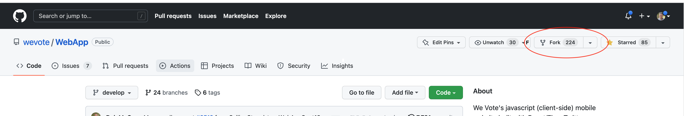 

6. Download and install the Community version of PyCharm, it's free!  (If you are a student, you can get WebStorm JavaScript IDE for free.  WebStorm is nice, but not necessary.)
    [https://www.jetbrains.com/pycharm/download/#section=windows](https://www.jetbrains.com/pycharm/download/#section=windows)
   1. Accept all the defaults until you get to the "Installation Options" tab.  Then check "Pycharm Community Edition" and "Add bin folder to the PATH".
      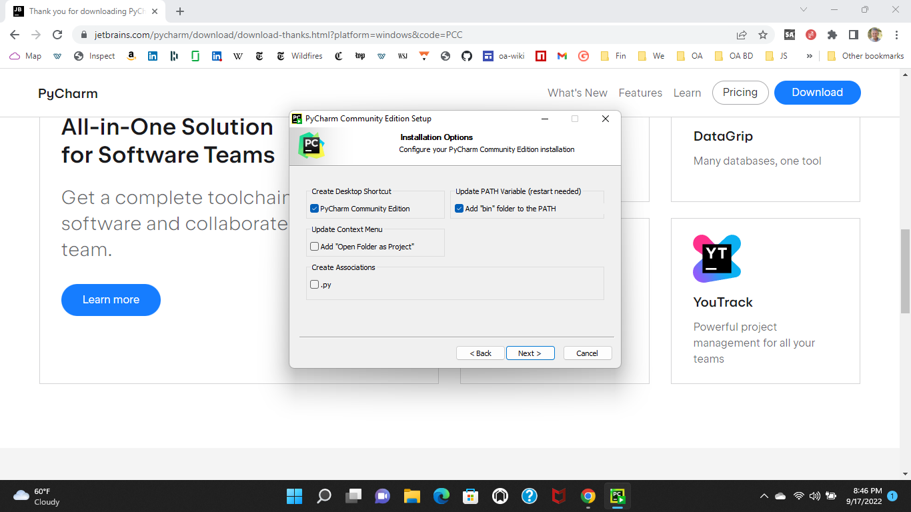
   2. Continue through the tabs, accepting the defaults, then finally press the "Install" button. When asked, Reboot now.  Then "Finish".
7. After the reboot there should be a PyCharm link on the desktop.  Double-click it to start PyCharm, and press the 'Get from VCS' button.

     

8. If you see a red "Git is not installed", "Download and Install" button, click it, and wait for the install to complete.
   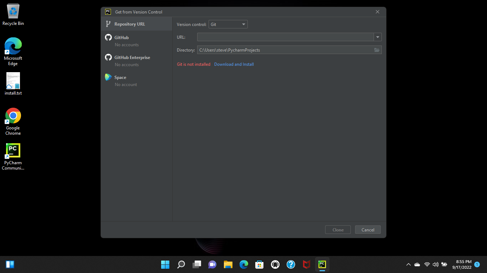
9. (Explanation only step): The step after this one clones the fork of your repository.

   What this means, is that in GitHub you have created a copy of the WebApp code in your account. Cloning from your account, downloads
   a copy of that copy to your PC.  This will be a working copy of the latest code in the repository.
10. Clone your fork of the git repository, by copying the URL to your repository into the URL field, then press the Clone button.  (These screenshots reference the developer SailingSteve, but your URL will have your GitHub account name in it.)

    It will take a minute or two, to clone, then say yes to "Trust Project"
    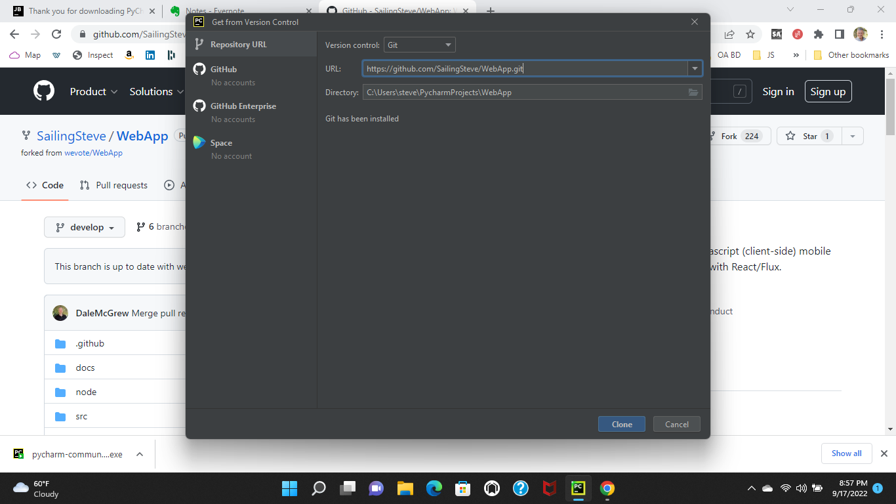

11. When the cloning is complete, press Ok to close the dialog.  The screen will look something like this. A copy of the latest WebApp source code files are now on your PC.

    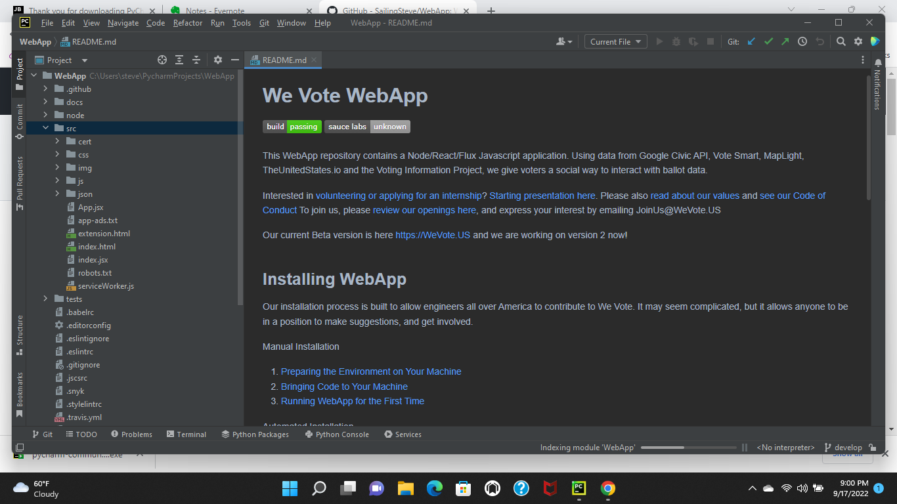
    At this instant, the 'develop' branch of wevote/WebApp matches
    your branch in your account on GitHub, and also matches the code on your Mac.

12. The PyCharm IDE appears initially in 'Dracula' mode, with the repository loaded to your disk, and ready to edit.

     

13. If you like 'Dracula' (dark background) mode, you can skip this step.  Open the File/Settings menu and the Appearance sub list, menu and press the
    'Sync with OS' button to match the display mode of your PC.

     
     


14. Download version 7.2 or higher of the Microsoft PowerShell terminal emulator.
   Navigate to https://github.com/PowerShell/PowerShell to get Version7.2 or higher.  As of Sept 2022, 7.2 was the "stable" release, but might be the "LTS" version by the time you are reading this.  Either should be fine as long as it is 7.2 or higher.
   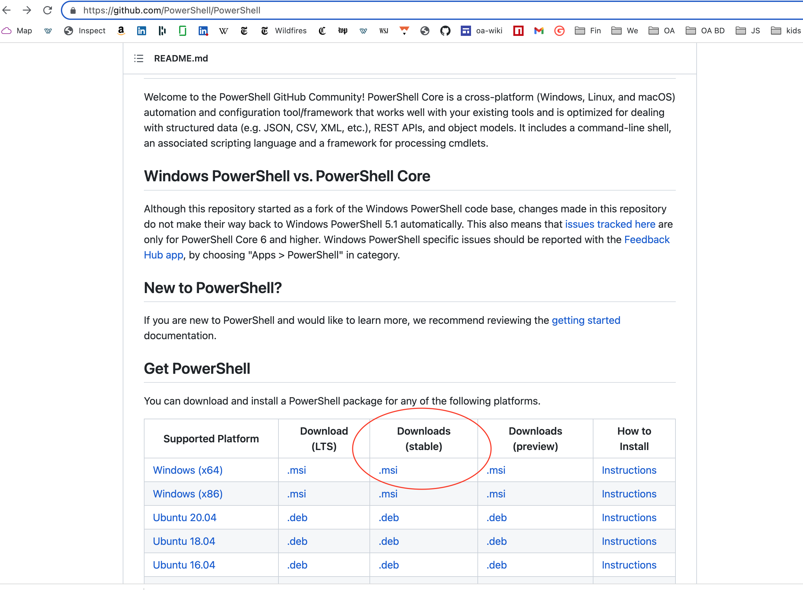

15. Double-click on the downloaded MSI and accept all the default settings.
    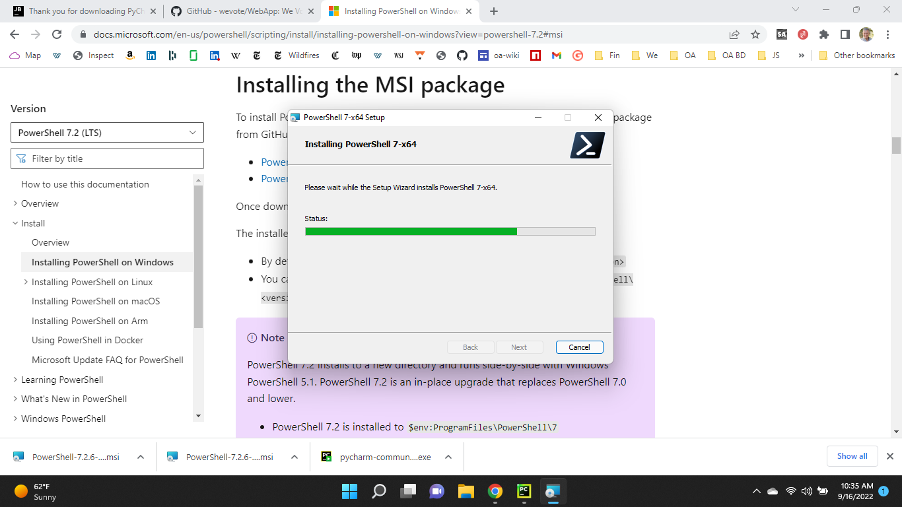
16. When the PowerShell installation completes, close PyCharm.  Wait for it to close, then reopen PyCharm, and go to File/Settings/Tools/Terminal and in the "Shell Path" pull down, Select "C:\Program Files\PowerShell\7\pwsh.exe" so that you will be using this updated PowerShell.
    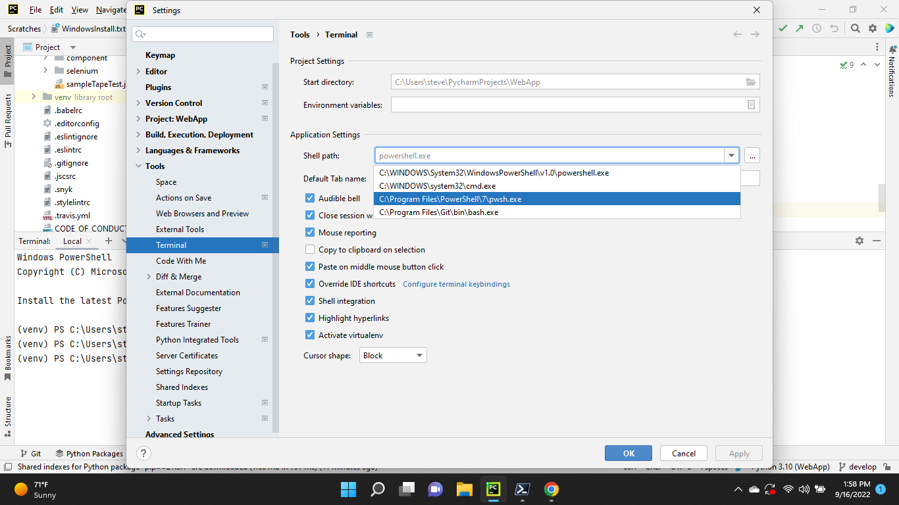
17. Press "Apply" and "OK"
18. If there are any open terminal windows at the bottom of the screen, close them.
19. Open the terminal, by clicking on the Terminal icon near the bottom of the screen.

    **Background info:** For Windows, the terminal program configured in PyCharm is Microsoft's "Windows PowerShell", it performs many of the same functions that a Unix/Linux/macOS terminal, but has built in access rights
    to the underlying Windows operating system.  PowerShell also understands both old MS-DOS style paths (C:\Users\steve\PycharmProjects\WebApp) and Unix/Linux/macOS style paths (~/PycharmProjects/WebApp), but it does not fully implement all the Linux commands that you would have in macOS or Linux terminal shell.  Oh, well.
    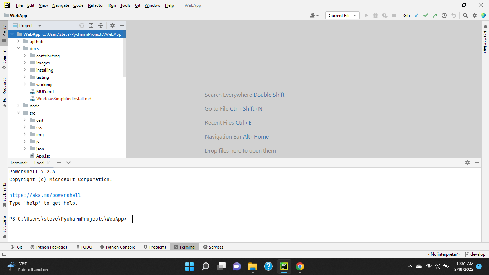
    **Note that the version of the PowerShell is 7.2 or greater.**
20. Set the line endings to "LF" in git so that your checkins will be converted from Windows style "CRLF" end of line codes, to the Unix/Linux/macOS "LF" end of line code.
    ```
    PS C:\Users\steve\PycharmProjects\WebApp> git config --global core.autocrlf false
    PS C:\Users\steve\PycharmProjects\WebApp> git config --global core.eol lf
    ```
    The Terminal window on the screen should look pretty much like this:
    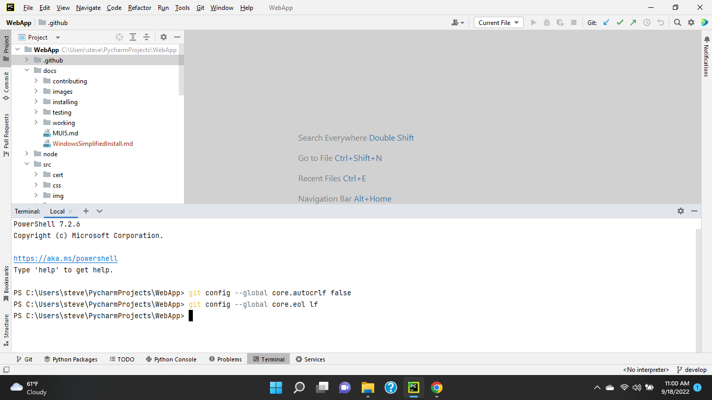

21. Create a .gitattributes file to handle the different line endings in Windows.  With the command line command `"text=auto" > .gitattributes` as shown below.
    ```
        PS C:\Users\steve\PycharmProjects\WebApp> "text=auto" > .gitattributes
    ```

22. Set PyCharm to use Unix and macOS line separators
 
    In File/Settings/Editor/Code Style, set the "Line separator" pull down to "Unix and macOS(\n)", and press "OK" 
    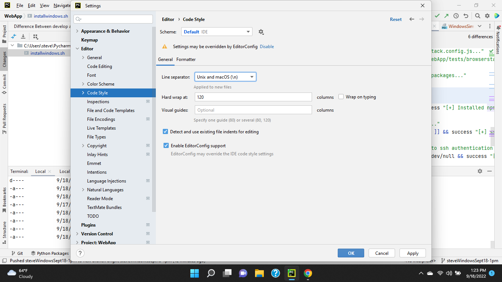
23. In PyCharm set up your git remotes. 
    1. Navigate to the Git/'Manage Remotes...' dialog  

    The WeVote open source project defines upstream and origin differently than most other projects, so we need to manually reverse them here.
    3. Click the edit (pencil) icon, and change the name field for the URL to your copy of the repository from "upstream" to "origin".  (The following picture shows the dialog before you make the Name change.)

    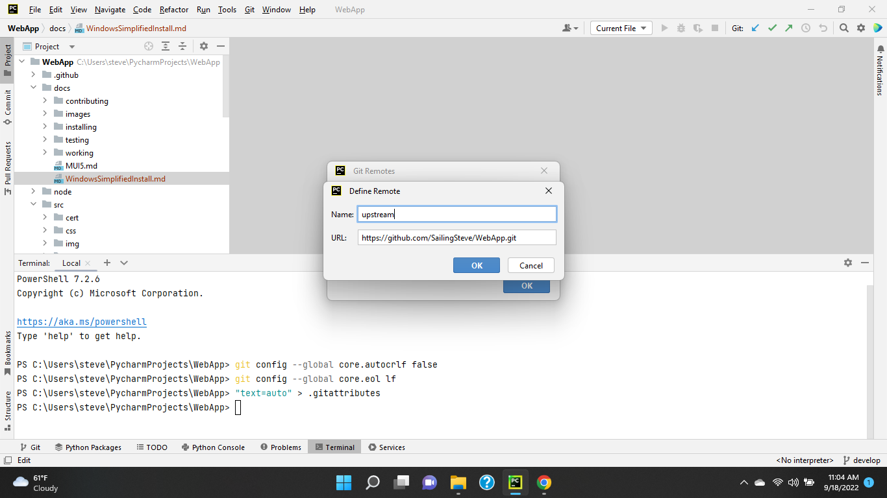
    5. Then add a remote for your WeVote's public branch by pressing the '+' button on the Git Remotes dialog. In the dialog that appears, set the name field to "upstream", and the URL to "https://github.com/wevote/WebApp.git".  Press OK and the remotes should look like this:  

    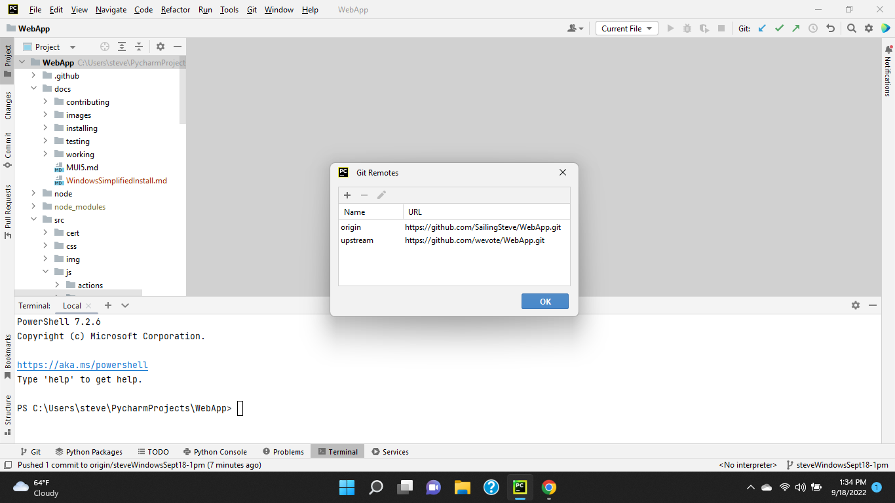
    Press OK to close the dialog.

24. Do a manual reload of the project files from git, this is needed to force the file end-of-line codes consistent, with the configuration changes you just made.
 
    Type these three commands into a terminal window:
    1. `git reset --hard HEAD`
    2. `git fetch --all`
    3. `git reset --hard upstream/develop`

    The screen output will look something like this (but all the numbers and branch names will be different)...
    ```
    PS C:\Users\steve\PycharmProjects\WebApp> git reset --hard HEAD
    HEAD is now at 7b7e7a859 Merge pull request #3512 from SailingSteve/steveWebAppSept13-1pm
    PS C:\Users\steve\PycharmProjects\WebApp> git fetch --all
    Fetching upstream
    Fetching origin
    remote: Enumerating objects: 95, done.
    remote: Counting objects: 100% (75/75), done.
    remote: Total 95 (delta 75), reused 75 (delta 75), pack-reused 20
    Unpacking objects: 100% (95/95), 112.95 KiB | 190.00 KiB/s, done.
    From https://github.com/wevote/WebApp
     * [new branch]          1.0-rc1                 -> origin/1.0-rc1
     * [new branch]          IssuesPopover           -> origin/IssuesPopover
     * [new branch]          snyk-fix-a63fb464454a06d0edd8026b1c658f37 -> origin/snyk-fix-a63fb464454a06d0edd8026b1c658f37
     * [new branch]          snyk-fix-bbd6dfb5d1986c43cb7b9bfcc9131966 -> origin/snyk-fix-bbd6dfb5d1986c43cb7b9bfcc9131966
     * [new branch]          snyk-fix-be5f00aebf47eb969d748bc9787f3e89 -> origin/snyk-fix-be5f00aebf47eb969d748bc9787f3e89
     * [new branch]          snyk-fix-c48e5a39c789bb5b7fdb278add659747 -> origin/snyk-fix-c48e5a39c789bb5b7fdb278add659747
     * [new branch]          snyk-fix-ef41a9ad65f559038fe8ec6dddc1e883 -> origin/snyk-fix-ef41a9ad65f559038fe8ec6dddc1e883
     * [new branch]          webpack                 -> origin/webpack
     * [new tag]             2.0.0                   -> 2.0.0
    PS C:\Users\steve\PycharmProjects\WebApp> git reset --hard upstream/develop
    HEAD is now at 7b7e7a859 Merge pull request #3512 from SailingSteve/steveWebAppSept13-1pm
    PS C:\Users\steve\PycharmProjects\WebApp>
    ```

25. In PyCharm, in the Project tab, find the file `WebApp/src/js/config_template.js` and copy it to `WebApp/src/js/config.js`

     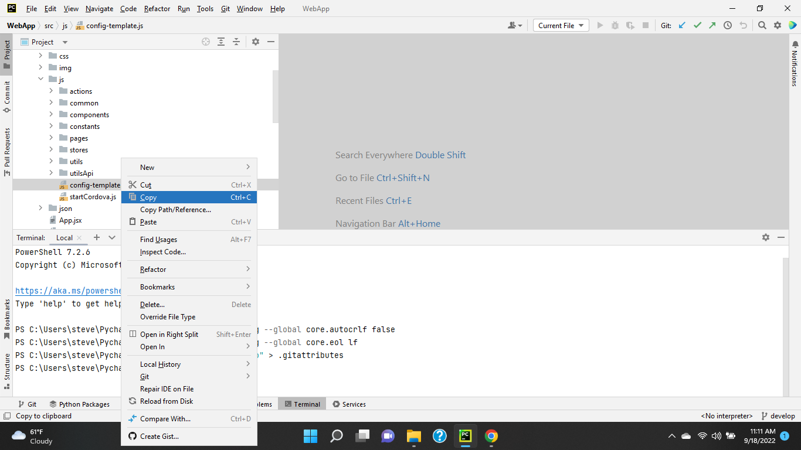

     To do this copy: Right click on `config_template.js` and select 'Copy', then right-click on the `js` 
     directory and select 'Paste' in the pop-up, and then in the copy dialog that opens up, and change the "New name:" to 
     `config.js` as shown below.

    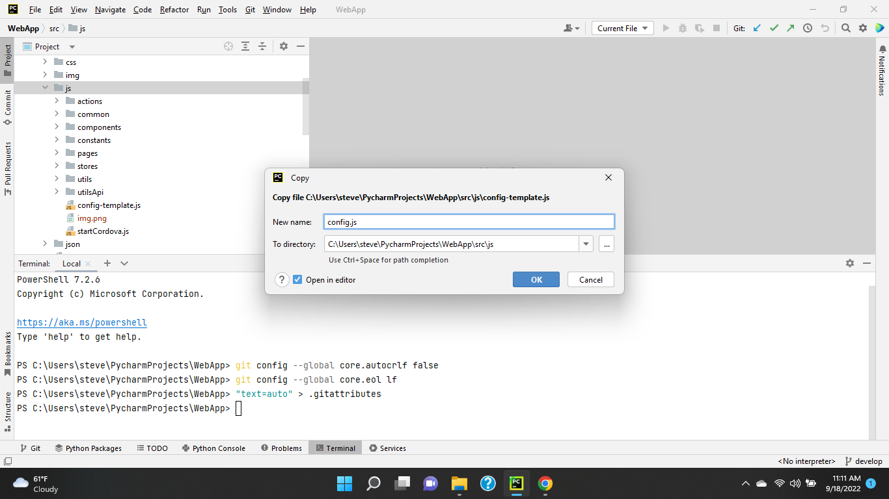
26. The `config.js` file contains configuration setting for this new setup on your PC.  There are a number of secret values in `config.js` that are not stored in source control.  You will need to check in with Dale, if you find that you need them.

    The default settings, copied from `config_template.js`, are enough to get you started.

27. Install Node.js - Windows.  Node allows JavaScript to be run natively on the command line -- without something like Node, JavaScript only runs in browsers.

    The following instructions were modified from this [blog post](http://blog.teamtreehouse.com/install-node-js-npm-windows).

    1. Open Chrome and download the Windows installer from the Node.js website:  https://nodejs.org/en/download/

       Choose the "LTS" version for Windows (The big green button!) 

    2. Run the installer (which is the .msi file you just downloaded).

    3. Follow the prompts in the Node installer.
       1. Accept the license agreement, click the NEXT button a few of times and accepting the default installation settings, until you get to the "Tools for Native Modules" page.  On this page click the "Automatically install the necessary tools" button, and then continue with the "Next" button
       3. Then "Install"
       4. Allow Node to make changes on your local computer.
       5. Ok, the "Install tool for Node.js Native Modules Installation Script" that opens in a detached PowerShell window.  This window is making a PC-wide upgrade or installation of Node.
       6. Allow "Windows PowerShell" to make changes to your device.
       7. FYI: This installs Node, Chocolatey, Python, Visual Studio, and more.
       8. Then patiently wait a 5 or 10 minutes for "Press enter" message to appear in the window, and then press "Enter".
   
    4. Restart your computer. You won’t be able to run Node.js® until you restart your computer.

28. If at any time you see a "download prebuilt indexes" dialog popping up in PyCharm, you can allow it with "Always download".

    This option really only matters for Python developers (WeVoteServer), but we don't currently have a set of installation instructions for the WeVoteServer running on Windows.

29. Test the Node, NPM, and Python installations in the terminal

    Make sure you have Node and npm installed by running simple commands to see that the programs can run from the command line, and what version of each is installed:

    ```
    PS C:\Users\steve\PycharmProjects\WebApp> Node -v
    v16.17.0
    PS C:\Users\steve\PycharmProjects\WebApp> npm -v
    8.15.0
    PS C:\Users\steve\PycharmProjects\WebApp> python --version
    Python 3.10.7
    PS C:\Users\steve\PycharmProjects\WebApp>
    ```

30. Install gulp
   In the terminal `npm install -g gulp-cli`

31. Install (the approximately 1600 open source packages, libraries or "node_modules" that WeVote uses as a foundation for our WebApp)

    In the terminal `npm install`

32. In the terminal allow scripts to be run by the current user (you!)

    Run the `Set-ExecutionPolicy` script as shown below.  The script will pause, and wait for you to type in "Bypass" and hit return.
```
    PS C:\Users\steve\PycharmProjects\WebApp> Set-ExecutionPolicy -Scope CurrentUser

    cmdlet Set-ExecutionPolicy at command pipeline position 1
    Supply values for the following parameters:
    ExecutionPolicy: Bypass
    PS C:\Users\steve\PycharmProjects\WebApp>
```

32. Make this configuration change, to allow the WebApp to be compiled under Windows. 

    Background: MS-DOS and subsequently Windows chose to end each line in a text file with a carriage-return followed by a line-feed (CRLF), but UNIX, Linux and macOS simply uses a line-feed (LF).  All WeVote source code files use LF when advancing to the next line, so this configuration is necessary to allow files on Windows to be able to be submitted to WeVote's git repositories.

    **This "fix" is a bit hacky, and you have to be sure not to commit this '.eslintrc' file to Git if you check in changes.**

    Open the '.eslintrc' file in the root of the project and add the line:
    ```
    linebreak-style: 0,
    ```
    Putting configuration lines like this in alphabetical order is a good practice.  (Peek at the first screenshot in the next section to see what the edited file looks like.)

    This configuration line, disables Windows vs Linux "lint" line break checking, and allows you to run the WebApp you compile on your Windows PC.


## Run the WeVote WebApp

1. In the terminal, type the command `npm run start-win` to start the local webserver.
   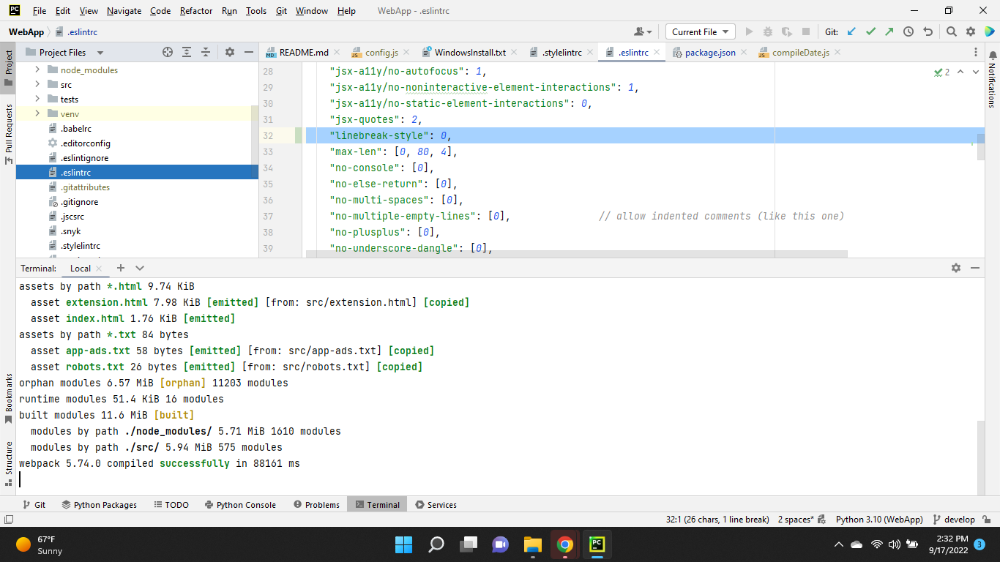
   When you see the line `webpack x.xx.x compiled successfully in xxxxx ms`, that means that a simple web server is running on your PC and will respond to browser URLs to localhost.  This might take a few minutes on slower PCs.
2. In Chrome, navigate to http://localhost:3000
   

**That's it!**  Now when you make changes in the JavaScript code, a few seconds later they will be compiled and pushed to the browser, which will update with the changes.  (These updates will happen in 1 to 25 seconds, depending on the speed of your PC.)
  
