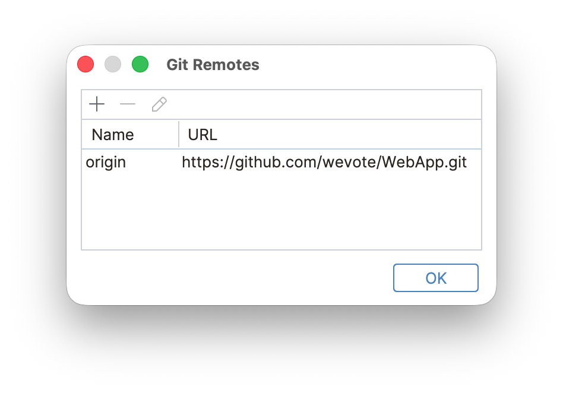
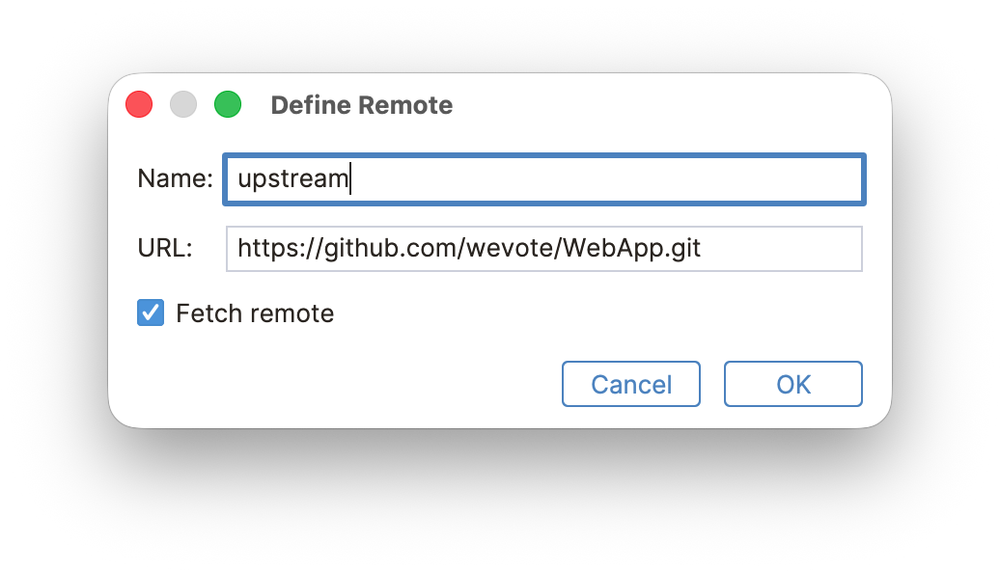
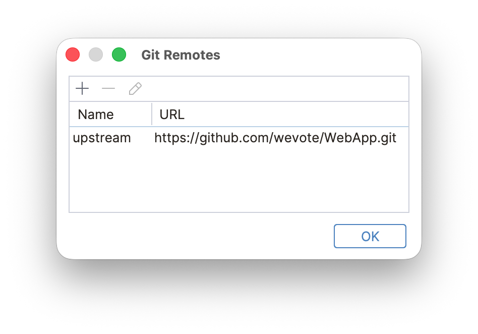
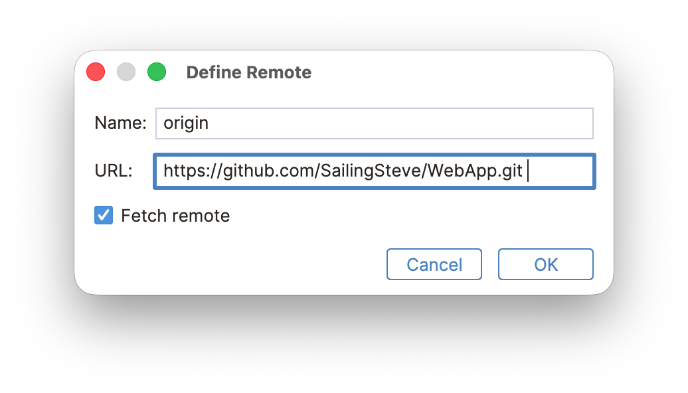
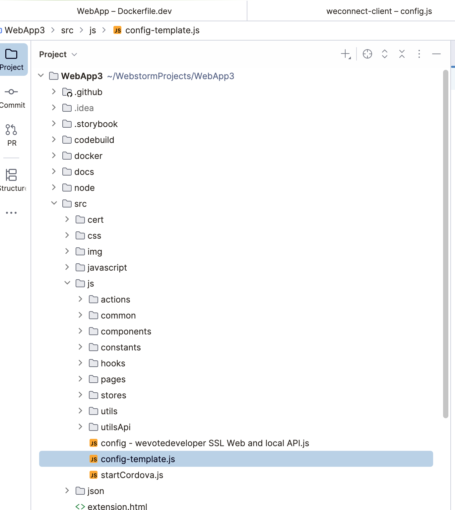
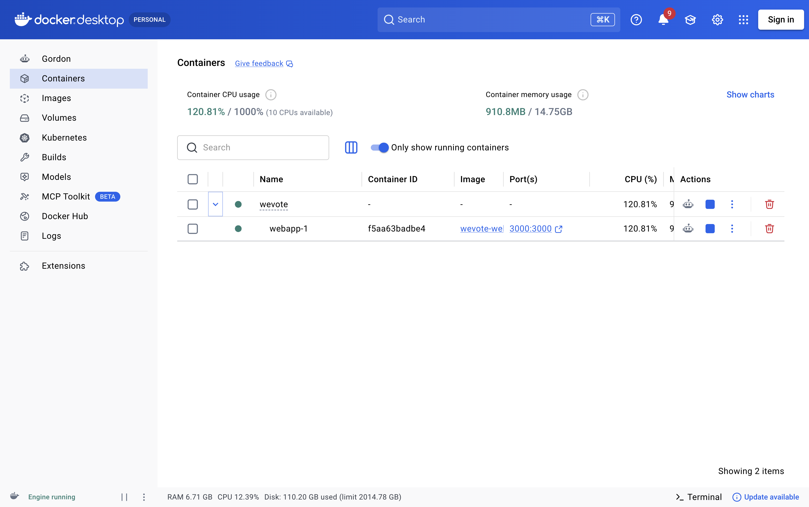
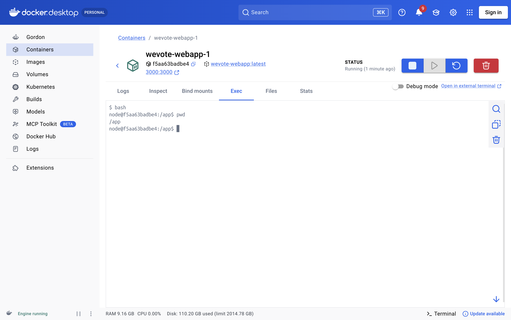

# Running WebApp on your machine with Docker

_Choose your path:_

1) If you have a Mac and would like to use the (free) WebStorm editor and IDE, **proceed to the next section**
2) If you have a high level of expertise with Docker and want to do much of your work in the terminal, goto [Docker For Experts](./DOCKER_FOR_EXPERTS.md)
3) If you use Windows and can setup WSL tooling, and want to use VS Code, or WebStorm, or another IDE.  We don't have any
specific instructions yet, but proceed with the documentation below, and make substituions as needed.

## WebApp install with WebStorm

This document assumes you are using a Mac, but it is close to what you would do with WebStorm for Linux, or
WebStorm for Windows.  (If you have an existing PyCharm setup you can use that too, with slightly fewer features.)

### Install WebStorm

Navigate to https://www.jetbrains.com/webstorm/download/?section=mac and download the IDE

### Download the weconnect-client code
1) In WebStorm, on the File menu | New | Project from Version Control
2) Enter the URL  https://github.com/wevote/WebApp.git
3) Press the Clone button

You now have the latest code for the WebApp on your computer

### Setup a GIT account if you don't already have one

Start at https://github.com/

After creating your account, an example might be:  https://github.com/SailingSteve/WebApp.git

### Clone the WebApp code into your account.

On GitHub, login to your account (create one if you don't have one) (For example https://github.com/SailingSteve)

Then navigate to the WebApp repository at https://github.com/wevote/WebApp

Press the "Fork" button on the upper right, select yourself on the "Owner" pull down

Leave 'Copy the develop branch only' checkbox checked

Press the "Create Fork" button.

**You're done!**, you now have a copy of the latest code in your GitHub account.


### Setup your GIT remotes

For historical reasons, WeVote uses the 'upstream' label for the link to the project's main repository, but most other projects use the 'origin' tag for that repository location.   

So while working on WeVote repositories 'upstream' is the repository you cloned to your private 'origin' repository.

In WebStorm navigate to Git | Manage Remotes...

The picture that follows shows the default setting that WebStorm starts with.



You will need to select the 'origin' line, and click the pencil icon, and change the word 'origin' to 'upstream' and press `OK`.



The 'upstream' link to the project repository is now correct for WeVote's WebApp.



Then press the **+** button to add the origin remote, in this case use the URL to your git repository for WebApp.  Then press `OK`.



Press `OK` to close the dialog

### Make a small necessary change to your /etc/hosts file
Running WebApp in SSL mode (https) on developer's computers is the default for our apps.  It allows access to APIs and oAuth redirects that would otherwise be blocked.

This change allows us to run WebApp in secure https mode on our local machines using real SSL certificates.

Make a second alias for 127.0.0.1 with this made up (but standardized for We Vote developers) domain: `wevotedeveloper.com`


First we have to make a small change to /etc/hosts.  This is the before:
```
    (venv3.13.2) stevepodell@StevesM1Dec2021 WeVoteServer % cat /etc/hosts
    ##
    # Host Database
    #
    # localhost is used to configure the loopback interface
    # when the system is booting.  Do not change this entry.
    ##
    127.0.0.1       localhost
    255.255.255.255 broadcasthost
    ::1             localhost
    (venv3.13.2) stevepodell@StevesM1Dec2021 WeVoteServer % 
```

On a Mac or Linux, edit this file with any terminal based editor you favor (`sudo nano /etc/hosts` or `sudo vi /etc/hosts` will work)  

Add a local domain alias `wevotedeveloper.com.`

To do this you need to add `wevotedeveloper.com` to your `127.0.0.1` line in /etc/hosts.  After the change:
```
    (venv3.13.2) stevepodell@StevesM1Dec2021 WeVoteServer % cat /etc/hosts
    ##
    # Host Database
    #
    # localhost is used to configure the loopback interface
    # when the system is booting.  Do not change this entry.
    ##
    127.0.0.1       localhost wevotedeveloper.com
    255.255.255.255 broadcasthost
    ::1             localhost
    (venv3.13.2) stevepodell@StevesM1Dec2021 WeVoteServer % 
```
Save the changes.

On a Mac or Linux, you may need to restart your terminal sessions to pick up these changes, if uncertain, exiting from WebStorm and restarting it will guarantee that this change is in effect for your setup.

### Download and start the Docker Desktop

Go to https://docs.docker.com/get-started/get-docker/

and download the Docker Desktop for Mac (or Linux or Windows)

Install it and start it up, you don't even need to create an account.

On a Mac, click on the Docker icon in your Apps tool, to start the program.

### Quick Start

#### 1. Create the shared Docker network

All WeVote services (WeVoteServer, WebApp, weconnect-server) share a Docker network named `wevote.`
Create it once (type this command into a terminal window within WebStorm):

```sh
docker network create wevote
```

#### 2. Install the SSL certificates


We have real commercial SSL certs from 'Sectigo' for wevotedeveloper.com

You can download them from the [WeVote Google Drive](https://drive.google.com/drive/folders/1q0KB2B8HB-AGTMLXrYq7x96McaEJ9_od?usp=drive_link)

If you don't have access to this drive, talk to your team leader or Dale.

The two files are `wevotedeveloper.com_key.txt` and `wevotedeveloper.com.crt`

Copy the two files to your cert directory  ./WebApp/src/cert

#### 3. Setup your config.js

Navigate in the Project pane to src/js/config-template.js



Right Click 'config-template.js' and select copy, then  right click again and paste it in as conf.js

There are configurable "secrets" in that file, that have been left blank, for example the keys for Google Maps API -- If you need them, ask your team lead or Dale.

#### 3. Build and start the services

```sh
docker compose up --build
```

This command will fail if the **Docker Desktop** is not running.

This command is needed for initial startup, and after any changes to the two Docker configuration files {compose.yaml and Dockerfile.dev} and
after any changes to package.json -- it rebuilds the Docker Container that are used to load the app.

The local copy of the WebApp will now be available at https://wevotedeveloper.com:3000


#### 4. Editing source files & Live code reloading

The source directory is mounted into the container at /app, so edits you make in WebStorm are reflected within a few seconds in the running WebApp. A program called Webpac watches for changes and restarts the server automatically.

Changes that you make to source files in WebStorm should automatically load, and force an update of the instance in your browser that has been loaded from https://wevotedeveloper.com:3000

For each change you make, you will see in the console

```
webpack 5.105.4 compiled successfully in 45154 ms
    [webpack-cli] Compiler is watching files for updates...
    [webpack-cli] File '/app/src/js/config.js' was modified
    [webpack-cli] Changed time is Wed Sep 02 2026 20:14:31 GMT+0000 (Coordinated Universal Time) (timestamp is 1788380071728)
    [webpack-dev-middleware] Compilation starting...
    [webpack-cli] Compiler starting... 
...
    [webpack-cli] Compiler finished
    [webpack-dev-middleware] Compilation finished
assets by status 59.3 MiB [cached] 980 assets
assets by status 12.8 MiB [emitted]
  assets by path *.js 12.8 MiB
...  
webpack 5.105.4 compiled successfully in 3584 ms
    [webpack-cli] Compiler is watching files for updates...
```

In rare cases, and only for a few files, you may need to force the reloading of the Docker "Layers" -- these files include `DockerFile.dev` and `compose.yaml.`  If you are making changes to those files run the following commands to force a reload:

```
docker compose build --no-cache 
docker compose up
```

#### 5. Debugging

Almost all debugging of the WebApp is done with the Chrome DevTools within the browser.  So no special setup is needed in WebStorm.

#### 6. Stop the services

```sh
docker compose down
```

### The Docker Desktop

[The Docker Desktop](https://www.docker.com/products/docker-desktop/) is a container managment tool.  By loading
WebApp from docker, it runs WebApp in a seperate container (virtual machine), that is automatically setup and configured for you.  This saves hours of initial setup, and provides a development environment that closely matches the production environment.
You can see sthe status of the running containers, and manually restart or kill containers from the Docker Desktop.



WebApp runs inside a Docker VM, and the Docker Desktop allows you to see the log from the WebApp and also allows you to run shell commands inside the VM -- this is very rarely needed -- 99% of the time the Terminal in WebStorm works great and does everything you need.




---

[Back to root README](../README.md)
