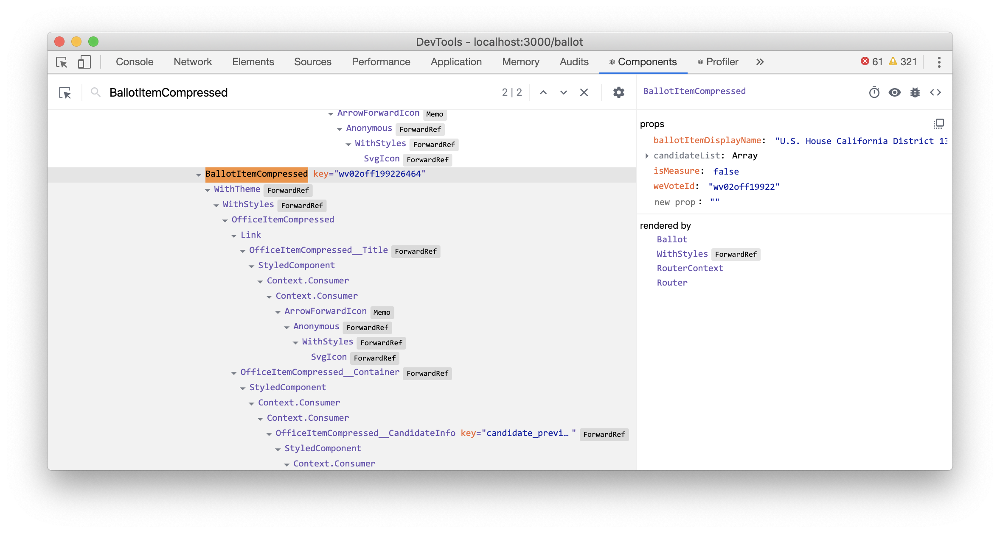
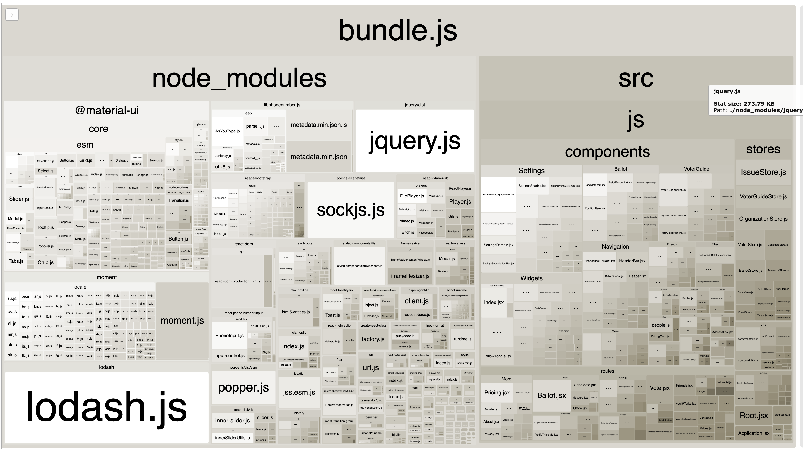

<!-- START doctoc generated TOC please keep comment here to allow auto update -->
<!-- DON'T EDIT THIS SECTION, INSTEAD RE-RUN doctoc TO UPDATE -->
## Contents

- [Debugging Tools and Tips](#debugging-tools-and-tips)
  - [Viewing server logs](#viewing-server-logs)
    - [Get an SSH key](#get-an-ssh-key)
    - [Get authorized and log in:](#get-authorized-and-log-in)
    - [Viewing Server Logs](#viewing-server-logs)
  - [](#)

<!-- END doctoc generated TOC please keep comment here to allow auto update -->

# Debugging Tools and Tips

## Viewing server logs
  If you would like to see the server logs while developing, you can follow these steps.

### Get an SSH key
  1. If you already have an SSH key you'd like to use, skip to the next section. Otherwise...
  2. Open a terminal on your local computer and enter the following: ssh-keygen -t rsa -C "your_email@example.com" ...
  3. Just press <Enter> to accept the default location and file name. ...
  4. Enter, and re-enter, a passphrase when prompted. ...
  5. You're done!

### Get authorized and log in:
  1. Run cd ~/.ssh/ at the command line.
  3. Copy the contents of the file id_rsa.pub (your public key).
  4. Email the key to servers@wevoteusa.org.
  5. You will receive an email with a command to login (ssh <username>@ec2-52-32-204-163.us-west-2.compute.amazonaws.com)
  6. Run the command, if prompted 'Are you sure you want to continue?' Type yes.
  7. You should now be logged in.

### Viewing Server Logs
1. To view server errors, run tail -F /var/log/wevote/wevoteserver.log
2. To view all the server activity, run tail -F /var/log/upstart/wevote-api.log
3. To only view activity that is coming from localhost:3000 on your computer, run tail -F /var/log/upstart/wevote-api.log | grep <voter_device_id>
4. Note: You can get your device_id by navigating to localhost:3000, opening chrome developer tools and finding the cookie labeled voter_device_id (under Resources > Cookies > Localhost)

### Improving Rendering Efficiency

Excessive component renders can makes the app slow, so we need to avoid them.  React will not update the DOM if none of the data changed
so all renders, will not change the DOM.  Finding the balance is the challenge.

Setting `LOG_RENDER_EVENTS: true,` in config.js logs a line like `render ==== TopCommentByBallotItem ====`
for every component rendered.  The console file can then be grepped or searched, and
other logging lines will be interleaved.

Alternatively if all you are looking at is renders, and are interested in which prop or state
change caused the render, the excellent ["React Developer Tools" for Chrome](https://chrome.google.com/webstore/detail/react-developer-tools/fmkadmapgofadopljbjfkapdkoienihi?hl=en) for Chrome adds 
a great components tab that shows why the component rendered



December 2019: When React 16.5 is in general release, the new Profiler tab
will also start working (and sounds very valuable). 

### Analyzing and Improving Bundle Size
 
  The [WebpackBundleAnalyzer](https://github.com/webpack-contrib/webpack-bundle-analyzer)
  has been installed, and provides amazing insight into the bundle.  To enable it, in webpack.config.js, set `isProduction to false` to enable the 
  BundleAnalyzerPlugin and the UnusedWebpackPlugin which scans for unused image and js files.
  UnusedWebpackPlugin sends its output to the build output in the terminal window 
  
  ```
  // Set isProduction to false, to enable the interactive bundle analyser and the Unused component analyzer
  const isProduction = true;   // Developers can set this to be true, but in git it should always be false
  ```
  `
An interactive UI, as shown below, will start up in a server and will be displayed in your browser.

  
  
### Do Cherypick from Libraries!

importing Button with decompostion from  '@material-ui/core' adds the entire '@material-ui/core' library to the bundle, which 
bloats the size of the bundle and makes startup over slow internet connections very slow.

```
import { Button } from '@material-ui/core';   /DO NOT DO THIS!!!!!
```

 instead, cherry pick the component, and only that component will be added to the bundle.  

 ```
import Button from '@material-ui/core/Button';
 ```

Making these changes for material-ui saved about 300 MB in bundle size!

Note that you can't load third level components this way, so you need to decompose second level components like this...
```
import { withStyles } from '@material-ui/core/styles';
```


### Code Splitting

TBD

https://webpack.js.org/guides/code-splitting/

Also built in support for code splitting "Suspense" in coming in React 16.6


---

Next: [Issues and Reporting Bugs](ISSUES.md)

[Go back to Readme Home](../../README.md)

