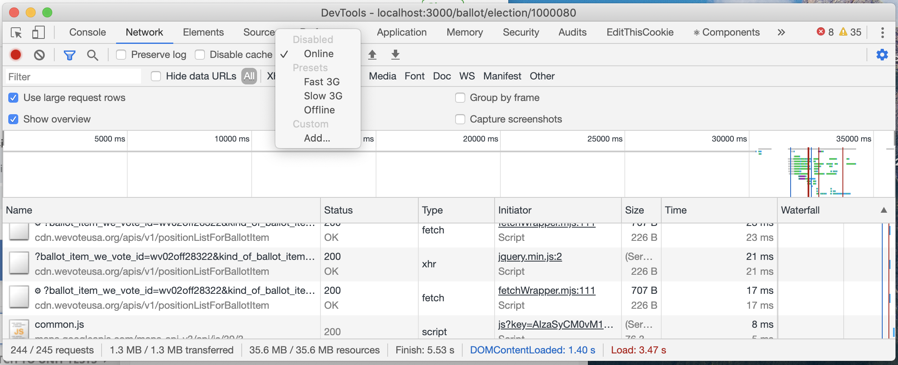
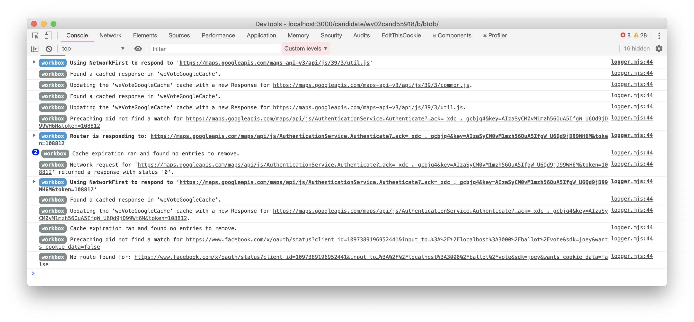
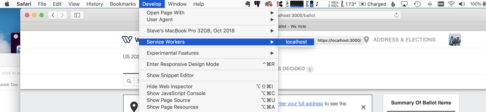
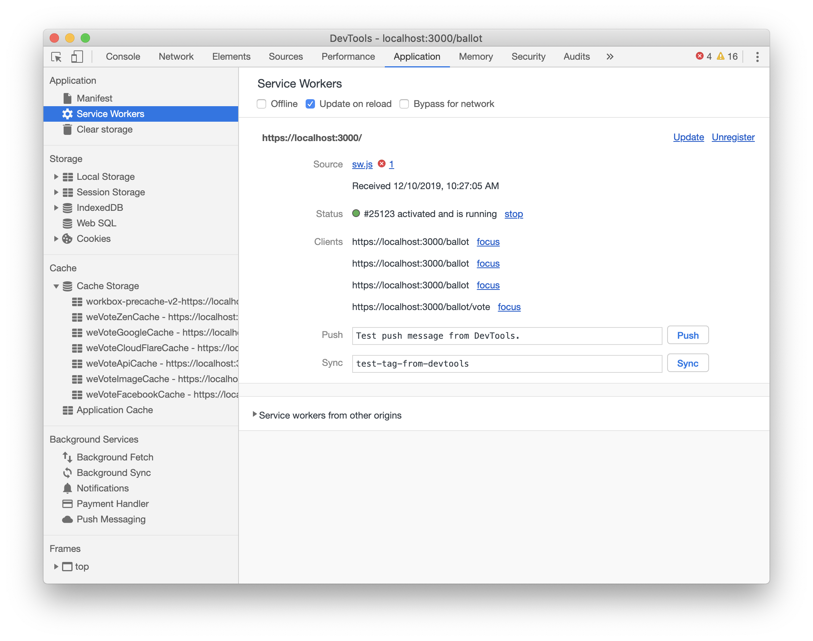

# Progressive Web App (PWA)

We use Google's [Workbox.js](https://developers.google.com/web/tools/workbox/guides/get-started) as an
"in-browser caching layer" to capture the WebApp's online data and code access, so that the necessary API data, libraries, and html pages are
(ideally) available off line.  It will happen that, if the voter has not navigated to a page, the html/jsx results might not be in
cache, or essential API data might not be in cache, and as a result the page might not be renderable offline.

This google tool promises to be platform and browser independent.

Adjusting Workbox settings (in ServiceWorker.js) will be an ongoing task to make sure that critical data/markup
is available to the voter when offline.  This caching layer also can speed up the loading of data from CDNs by
caching it locally.

It is possible to cache too much, or not have the cached data expire soon enough, which makes for a bloated load
of the browser, and could needlessly use up valuable RAM memory on the voter's computer.   We Vote developers woring on
this feature should take a look at all the other service workers that your browser has accumulated over the years (Application tab in
Chrome Tools, under Application/ServiceWorkers  and then at the bottom via "Service workers from other origins").  If you press
the "Clear storage" button it will not immediatley clear storage, but will show you how much
storage has been allocated by service workers, cache, etc. (432MB on my computer!)

We load Workbox.js and the associated plug-ins with the [workbox-webpack-plugin](https://developers.google.com/web/tools/workbox/modules/workbox-webpack-plugin)

See
* [common recipes](https://developers.google.com/web/tools/workbox/guides/common-recipes)
* [PWA Web Fundamentals](https://developers.google.com/web/progressive-web-apps) video from a Google Developer's conference, for an overview.
* An interesting article with some debugging tips [Build A PWA With Webpack And Workbox](https://www.smashingmagazine.com/2019/06/pwa-webpack-workbox/)

## Service Worker

All the configuration that we control for the PWA feature is in ServiceWorker.js (plus a tiny bit in index.js).

Webpack takes ServiceWorker.js, "compiles" it to sw.js in the /build directory, and
builds the `precache-manifest.101d23801c88cc8106f7bef3bcc7436e.js`, which is also in the /build directory.
The precache-manifest is automatically built, and has a list of known files to pre-cache, the other files are picked up from routes in ServiceWorker.js

## Testing

How to tell the debugger to simulate offline behaviour.

An example of console log output, while testing for caching coverage

On the first line the blue icon indicates that a file was served from cache using the NetworkFirst methodology.

On the sixth line, we can see that google maps has not been cached (but most likely we would not want to bother with that
since we only use it for finding voter/poll locations.)

All those log is supposed to be suppressed on production builds, and could be turned off in debug
builds with `workbox.setConfig({debug: false})`

## Safari

In Safari go to Develop/Service Workers/localhost to see the Service Worker log.  Safari does not have an offline mode, but you can
fake it by killing the Webpac Server (Ctrl+c in the terminal window).

## Firefox
Firefox has a File/Work Offline option that is useful for testing.  The built in Firefox debugger (right-click and Inspect Element)
shows Service Domain logging mixed in with App Domain logging like Chrome.

## Clearing ALL Caches

There is probably a better way of doing this, but if you are adding a new route
or renaming a cache, follow these steps for a certain clean start.
1) Kill your webpack server (Ctrl+c in the terminal window)
2) Then delete your build directory from disk (WebApp/build)
3) In the Chrome debugger for the tab loading `localhost:3000/` that the webpack was serving.
    1) In the Application tab, under "Application/Service Workers", Unregister the sw.js service worker.
        
    2) Then under Cache/Cache Storage, right click on each of the individual stores (like weVoteZenCache)
    and select delete, until all the stores are gone.
4) On the Console tab, clear the console (the round null symbol).
5) On the Network tab, clear the network log.
6) Restart your webpack server (npm run start-https)
7) In the Chrome tab that is attached to the debugger tab (or window), click the
reload (circular arrow) button and hold it down until the menu appears, and select "Hard Reload"

---

[Go back to Readme Home](../../README.md)
