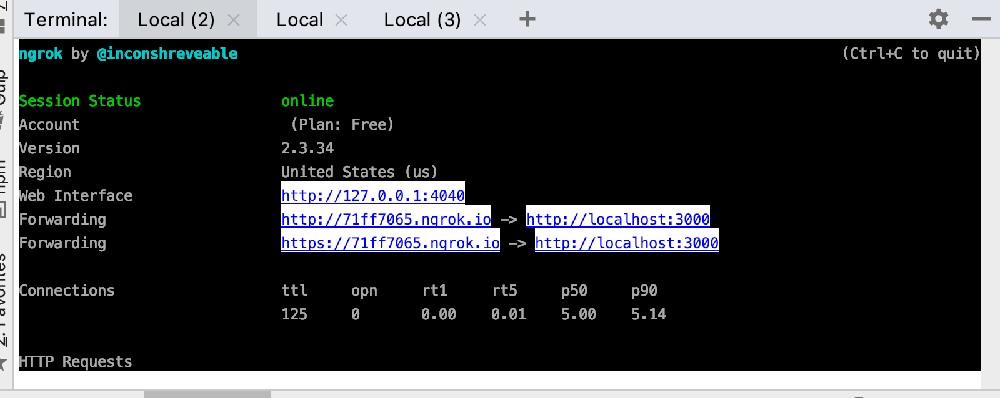

<!-- START doctoc generated TOC please keep comment here to allow auto update -->
<!-- DON'T EDIT THIS SECTION, INSTEAD RE-RUN doctoc TO UPDATE -->
## Contents

- [Working with WebApp Day-to-Day](#working-with-webapp-day-to-day)
  - 

<!-- END doctoc generated TOC please keep comment here to allow auto update -->

# Working with WebApp Day-to-Day

If you are returning to work on WebApp and other developers have made changes, follow these steps.

Update WeVoteServer first (the code that powers the Django/Python API Endpoints). [See instructions here](https://github.com/wevote/WeVoteServer/blob/master/README_WORKING_WITH_WE_VOTE_SERVER.md)

Grab the latest code from https://github.com/wevote/WebApp

Activate the virtual environment:

    $ cd /Users/<YOUR NAME HERE>/NodeEnvironments/WebAppEnv/
    $ . bin/activate

Install changes and start web application

    (WebAppEnv) $ cd /Users/<YOUR NAME HERE>/MyProjects/WebApp
    (WebAppEnv) $ npm install
    (WebAppEnv) $ npm start

Webpack will open a tab in your browser displaying the WebApp here:

    http://localhost:3000
    
The first start up of Webpack takes a bit of time (30 to 120 seconds), but subsequent compiles only take a few seconds, and are immediately 
re-rendered in the WebApp instance in the new tab

# Working with https for Twitter Signin

Download and install ngrok, [https://ngrok.com/](https://ngrok.com/)  (I just installed ngrok into my WebApp directory)

..."What is ngrok?  ngrok exposes local servers behind NATs and firewalls to the public internet over secure tunnels."

After the ngrok install is complete, run it in a terminal window:

    (WebAppEnv) $ ./ngrok http 3000 -host-header="localhost:3000"

ngrok takes over that terminal window and runs with a real time status display:

Then modify your config.js ...

    /* eslint-disable */
    // Note that we import these values where needed as "webAppConfig"
    module.exports = {
      WE_VOTE_URL_PROTOCOL: "https://", // "http://" for local dev or "https://" for live server
      WE_VOTE_HOSTNAME: "71ff7065.ngrok.io", // Don't add 'http...' here!  Live server: 'WeVote.US', Quality: 'quality.WeVote.US', developers: 'localhost:3000'

Now (in this example) there is a ssl tunnel from the public internet from https://71ff7065.ngrok.io to http://localhost:3000 on your
computer.  Your local WebServer can be accessed by anyone in the world, although they would need to know the address, and ngrok generates
a new address each time it is restarted.

Navigate to https://71ff7065.ngrok.io (for example) in your browser (in any browser) and you will see your local in SSL, and can login with Twitter.

As of July 31, 2019, if you use ssl with ngrok, webpack WILL NOT update your browser when your code changes, you will
have to manually refresh your browser to see the changes, and refreshes are slower with Webpack.

# Building a bundle.js for Cordova or our Production webservers

    npm run prod
    
As of July 31, 2019, this bundle works with Cordova, but hasn't been tested on production servers.    

# How to Update to Latest Changes from “develop” Branch

The process of stashing code and unstashing code (including dealing with merge conflicts) is much easier if you use an IDE (Integrated Development Environment) like <a href="https://www.jetbrains.com/pycharm/download/">PyCharm Community Edition</a>. This is how you can do it from the command line.

Ctrl-C to stop npm from running. Then:

`(WebAppEnv) $ git stash save "my_branch_20170101"`  # Set aside your current work locally

`(WebAppEnv) $ git branch -a`  # See what branch you are currently set to (look for "*" on left of listing)

`(WebAppEnv) $ git checkout develop`  # If you aren’t set to the develop branch, switch to that

`(WebAppEnv) $ git pull upstream develop`  # Tell your personal fork on your local machine to get the latest from wevote/WebApp

`(WebAppEnv) $ git push origin develop`  # Push this latest version of develop up to your Personal Fork on the github servers

`(WebAppEnv) $ git checkout -b <your-feature-branch>`  # Create a new branch with the name you want to use for your pull request

`(WebAppEnv) $ git stash list`  # Remind yourself the stash name you used

`(WebAppEnv) $ git stash apply stash^{/my_branch_20170101}`  # Apply your stashed code on top of the latest develop branch

Restart web application

    (WebAppEnv) $ npm install
    (WebAppEnv) $ npm start

We have created <a href="https://docs.google.com/drawings/d/1ED4X3Gpy_UruGDSiO8FjjxQeGOmQqIApguodHDo6-ok/edit">this diagram</a> to show the typical flow when preparing a pull request.

---

Next: [Debugging Tools and Tips](DEBUGGING_TOOLS.md)

[Go back to Readme Home](../../README.md)
