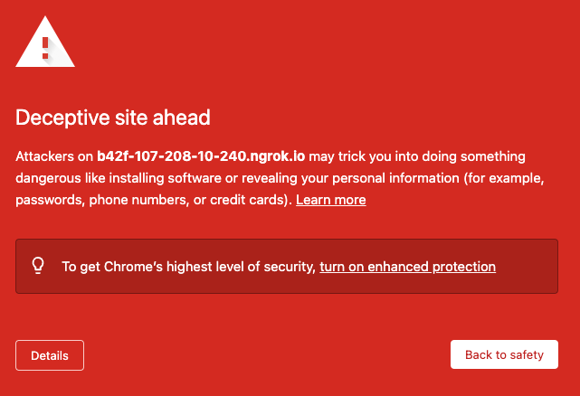
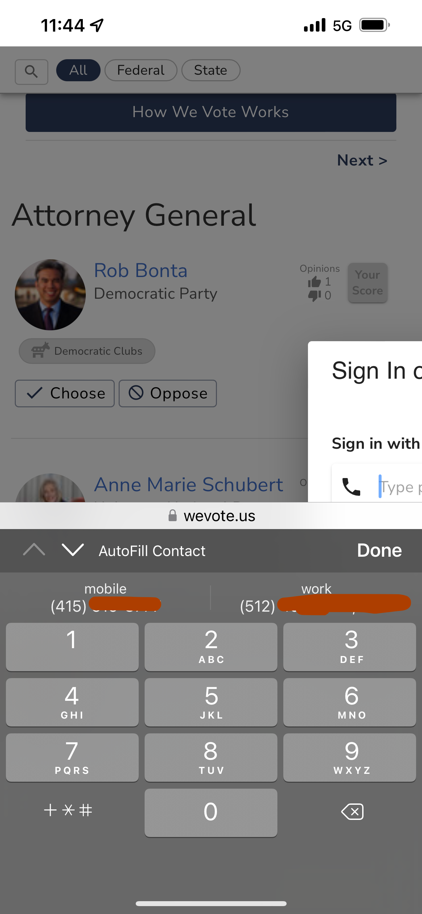

<!-- START doctoc generated TOC please keep comment here to allow auto update -->
<!-- DON'T EDIT THIS SECTION, INSTEAD RE-RUN doctoc TO UPDATE -->
## Contents

- [Working with ngrok](#Working with ngrok)
  - [Installing and starting ngrok](#Installing and starting ngrok)
  - [Using the Safari debugger to debug the WebApp including the Virtual Keyboard](#Using the Safari debugger to debug the WebApp including the Virtual Keyboard)

<!-- END doctoc generated TOC please keep comment here to allow auto update -->

# Working with ngrok

## Installing and starting ngrok

If you are looking for instructions about testing the Donation System using your local machine, visit [this page on WeVoteServer](https://github.com/wevote/WeVoteServer/blob/develop/docs/README_DONATION_SETUP.md).

1. Setting up a ngrok tunnel

    "What is ngrok? ngrok exposes local servers behind NATs and firewalls to the public internet over secure tunnels."

    "How it works: You download and run a program on your machine and provide it the port of a network service, usually a 
web server.

    It connects to the ngrok cloud service which accepts traffic on a public address and relays that traffic through to the 
ngrok process running on your machine and then on to the local address you specified."

    This allows you to run a tunnel server on your local, so that an incoming request (from testing on a mobile phone for example) gets routed to the ngrok server that you setup, gets redirected to your localhost.  While the ngrok server is running, it is like having a static address on the 
public internet.

    Download and install ngrok, follow the steps on [https://dashboard.ngrok.com/get-started](https://dashboard.ngrok.com/get-started)

    For redirecting traffic to localhost, the free ngrok account is all you need.

    Start ngrok on the same port that your WebApp local server is running on, in this example port 3000.

    So in this example any http request to https://1cf01df55b1d.ngrok.io on the public internet will end up redirected to my local
Node server's port 3000.

2. Installation tips.

   * From  [https://dashboard.ngrok.com/get-started/setup](https://dashboard.ngrok.com/get-started/setup) Download the zip file.
   Copy that file to the same directory where you installed "WebApp". ex/ `/Users/DaleMcGrew/PycharmProjects`

   * ```unzip ~/PycharmProjects/ngrok-stable-darwin-amd64.zip```
    
   * ```~/PycharmProjects/ngrok authtoken 26CsKp372M31CebyQc9Ae7SK2ga_ysgsHU2CCYYYYYYYYY```

   * Gives the response: ```Authtoken saved to configuration file: /Users/dalemcgrew/.ngrok2/ngrok.yml```
    
   * Start up the local process on your machine with: ```~/PycharmProjects/ngrok http https://localhost:3000 -host-header="localhost:3000"```


```
    ngrok by @inconshreveable                                                                                                                                                                                       (Ctrl+C to quit)
                                                                                                                                                                                                                                    
    Session Status                online                                                                                                                                                                                            
    Account                       DaleMcGrew (Plan: Free)                                                                                                                                                                           
    Version                       2.3.40                                                                                                                                                                                            
    Region                        United States (us)                                                                                                                                                                                
    Web Interface                 http://127.0.0.1:4040                                                                                                                                                                             
    Forwarding                    http://b42f-107-208-10-240.ngrok.io -> https://localhost:3000                                                                                                                                      
    Forwarding                    https://b42f-107-208-10-240.ngrok.io -> https://localhost:3000                                                                                                                                     
                                                                                                                                                                                                                                    
    Connections                   ttl     opn     rt1     rt5     p50     p90                                                                                                                                                       
                              0       0       0.00    0.00    0.00    0.00  
```

3. Test it by using the Forwarding address. You will get an error like this. Click Details, then "visit this unsafe site":

    

    * Note that the with the free ngrok account, the Forwarding address will change every time you start the local process.


## Using ngrok and the Safari debugger to debug the WebApp including the Virtual Keyboard

To debug styling that only is in effect when the virtual keyboard is display, you need to use Safari.  (The Chrome DevTools debugger does not display a simulated virtual keyboard when in responsive or device dimensions modes.)

An example of a bug that is only visible with the virtual keyboard opened.


1) Startup ngrok
2) Get the https ngrok tunnel address URL to your iPhone by AirDrop or Messages, etc.
3) Start that in Safari (not in Chrome for iOS)
4) Start Safari on your Mac
5) On the Develop menu, under the name of your phone, open the menu and select the ngroc.io tab, and a debugger opens on your Mac, that is similar to DevTools.


Hint: To select an element for style analysis on your phones Safari tab, click on target icon on the far left
of the Safari Debuger menu, then with you finger click on the element on your phone that you would like to 
examine.


[Go back to Readme Home](../../README.md)
